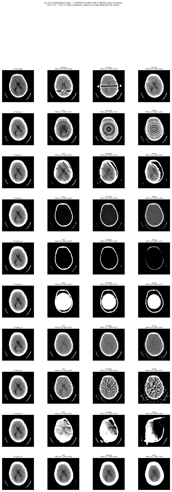
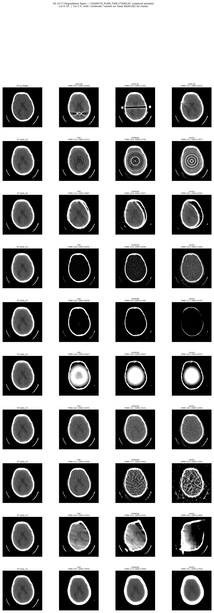

# CT Degradation Models - Complete Documentation

> All **10** CT degradation simulation models in `ctagent`, with physics, method, parameters, validity, and visualization.

---

## Overview

| # | Type | Chinese | Injection Domain | Restorability |
|---|------|---------|-----------------|---------------|
| 1 | Metal Artifact | 金属伪影 | 3-material poly pipeline | Medium |
| 2 | Ring Artifact | 环状伪影 | post-BHC sinogram | **High** |
| 3 | Motion Artifact | 运动伪影 | post-BHC sinogram | Medium |
| 4 | Beam Hardening | 束硬化伪影 | pre-BHC (proj_kvp_noise) | **High** |
| 5 | Scatter Artifact | 散射伪影 | pre-BHC transmission domain | Medium-High |
| 6 | Truncation | 截断伪影 | post-BHC sinogram | Medium |
| 7 | Low-Dose Noise | 低剂量噪声 | clean projection (proj_kvp) | **High** |
| 8 | Sparse-View | 稀疏角采样 | post-BHC sinogram | **Low** |
| 9 | Limited-Angle | 有限角采样 | post-BHC sinogram | **Low** |
| 10 | Focal Spot Blur | 焦点模糊 | post-BHC sinogram | Medium |

---

## 1. Base Pipeline (通用基线流水线)

All degradation models share a unified physics simulation baseline (`_prepare_base_state`):

```
Input: HU image
  Step 1: HU -> mu            mu = HU/1000 * mu_water + mu_water  (mu_water=0.192)
  Step 2: Tissue decompose    img_water + img_bone (threshold-based linear interp)
  Step 3: Forward projection  ASTRA-CUDA fan-beam, 416x416, 640 angles, 641 detectors
  Step 4: pkev2kvp            Beer-Lambert + X-ray spectrum weighting
          => proj_kvp (clean polychromatic projection)           [SAVED]
  Step 5: Poisson noise + Gaussian electronic noise
          => proj_kvp_noise (noisy pre-BHC projection)           [SAVED]
  Step 6: Water-based BHC     BHC(p) = c1*p + c2*p^2 + c3*p^3
          => poly_sinogram -> poly_ct = FBP(poly_sinogram)       [GT reference]
```

**Key intermediate states:**

| Variable | Domain | Used by |
|----------|--------|---------|
| `proj_kvp` | Clean poly projection (no noise) | Low-Dose |
| `proj_kvp_noise` | Noisy poly projection (pre-BHC) | Beam Hardening, Scatter |
| `poly_sinogram` | Post-BHC sinogram | Ring, Motion, Truncation, Sparse-View, Limited-Angle, Focal Spot |
| `poly_ct` | Clean FBP reconstruction | All (as GT) |

**Validity:** Multi-energy spectrum modeling (30-120 keV), Poisson photon counting (I0=2e7), Gaussian electronic noise (sigma_e=10), 3rd-order polynomial BHC from physics fitting.

---

## 2. Metal Artifact (金属伪影)

**Source:** `dataset/mar/mar_simulator.py` — `MARSimulator` (7-step pipeline)

### Physics
Metal implants cause extreme X-ray attenuation:
- **Photon starvation**: detector counts near zero through metal path
- **BHC residual**: high-Z materials cause severe polychromatic effects
- **Streak artifacts**: radial bright/dark streaks after reconstruction

### Method
```
Steps 1-6: Same as base pipeline (no metal)
Step 7: Per-mask metal artifact injection
  7a: Resize binary metal mask -> forward projection -> metal_trace
  7b: Partial Volume Effect (PVE): edge pixels *= 0.25
  7c: 3-material polychromatic projection: [water, bone, metal] -> pkev2kvp
      Metal chosen from: Ti, Stainless Steel, CoCr, Au
  7d: Poisson noise -> BHC -> FBP reconstruction -> ma_CT
  7e: Corrections produced: LI_CT (linear interpolation), BHC_CT (MAR-BHC)
```

### Parameters
- Metal masks: `SampleMasks.mat` (100 masks, various shapes/sizes)
- Metal materials: Ti / SS / CoCr / Au (via `material_id`)
- I0 = 2e7, PVE edge_fraction = 0.25

### Validity: **STRONG** ✅
Most physically accurate model. Full 3-material polyenergy simulation + PVE + photon starvation. Reference: ADN (MICCAI 2019).

---

## 3. Ring Artifact (环状伪影)

**Source:** `dataset/mar/ct_artifact_simulator.py` — `RingArtifactSimulator`

### Physics
Detector unit **gain drift** or **offset bias** causes systematic error in specific sinogram columns. After FBP: **concentric rings** centered on rotation axis.

### Method (post-BHC sinogram)
```
1. Select n_bad detector columns randomly (0.5%-3.0% of total)
2. Per bad column apply:
   a. Multiplicative gain:  col *= gain       (gain in [0.85, 1.15])
   b. Additive bias:        col += bias       (proportional to sinogram std)
   c. Time-varying drift:   col += A*sin(2*pi*t)*cos(phase)
3. FBP reconstruction
```

### Parameters

| Param | mild | moderate | severe |
|-------|------|----------|--------|
| bad_detector_fraction | 0.5%-1.0% | 1.0%-2.0% | 2.0%-3.0% |
| gain_range | [0.95, 1.05] | [0.90, 1.10] | [0.85, 1.15] |
| additive_bias_scale | 0.003 | 0.006 | 0.010 |
| drift_strength | 0.002 | 0.004 | 0.008 |

### Validity: **STRONG** ✅
Multiplicative + additive + time-varying modes cover real detector failure patterns. Ref: Sarepy, Muench et al. 2009.

---

## 4. Motion Artifact (运动伪影)

**Source:** `dataset/mar/ct_artifact_simulator.py` — `MotionArtifactSimulator`

### Physics
Patient rigid-body translation during scan mixes projection data from different positions:
- **Ghosting** (duplicate edges), **blurring**, **streaks**

### Method (post-BHC sinogram)
```
1. Select continuous angle range [start, end] (8%-30% of views)
2. Progressive sub-pixel shift along detector direction:
   shift = signed * shift_max * linear_ramp(t)
3. Sub-pixel interpolation via np.interp
4. Ghost blending: (1-blend)*shifted + blend*original
5. Gaussian smoothing along view axis (sigma=0.8)
6. FBP reconstruction
```

### Parameters

| Param | mild | moderate | severe |
|-------|------|----------|--------|
| motion_fraction | 8%-12% | 12%-20% | 20%-30% |
| translation_mm | 1-5 | 5-10 | 10-15 |
| ghost_blend | 0.15 | 0.25 | 0.35 |

### Validity: **GOOD** ✅
Progressive shift + ghost blending simulates realistic gradual patient motion. Ref: TorchIO RandomMotion.

---

## 5. Beam Hardening (束硬化伪影)

**Source:** `dataset/mar/ct_artifact_simulator.py` — `BeamHardeningArtifactSimulator`

### Physics
Polychromatic X-rays: low-energy photons preferentially absorbed. Imperfect BHC leaves:
- **Cupping effect**: image center darker (more material = more hardening)
- **Band artifacts**: dark bands between dense bone structures

### Method (pre-BHC: proj_kvp_noise)
```
1. Take proj_kvp_noise (noisy polychromatic projection, NOT BHC-corrected)
2. Perturb BHC polynomial coefficients:
   perturbed_bhc = para_bhc * bhc_scale    (bhc_scale < 1 = undercorrection)
3. Apply perturbed BHC:   result = c1*s*p + c2*s*p^2 + c3*s*p^3
4. FBP reconstruction
```

### Parameters

| Param | mild | moderate | severe |
|-------|------|----------|--------|
| bhc_scale | 0.85-0.95 | 0.65-0.85 | 0.40-0.65 |

### Validity: **STRONG** ✅
Injection at pre-BHC domain is **physically correct**. Perturbing BHC coefficients is the most accurate simulation of incomplete correction (undercorrection -> cupping). Previous version was incorrect (post-BHC additive model -> anti-cupping), now fixed. Ref: Hsieh 2004, MAR_SynCode guide.

---

## 6. Scatter Artifact (散射伪影)

**Source:** `dataset/mar/ct_artifact_simulator.py` — `ScatterArtifactSimulator`

### Physics
Compton scattering produces low-frequency smooth background on detector:
- **Contrast reduction**, **image fogging**, **cupping-like effect**

### Method (pre-BHC: proj_kvp_noise, transmission domain)
```
1. Take proj_kvp_noise (noisy polychromatic, pre-BHC)
2. Convert to transmission: primary = exp(-proj_kvp_noise)
3. Generate scatter:  scatter = ratio * GaussianBlur(primary, sigma)
4. Combine:           measured = primary + scatter   (additive in intensity!)
5. Back to projection: contaminated = -log(measured)
6. Apply BHC:          result = BHC(contaminated, para_bhc)
7. FBP reconstruction
```

### Parameters

| Param | mild | moderate | severe |
|-------|------|----------|--------|
| scatter_ratio | 1%-3% | 3%-6% | 6%-10% |
| blur_sigma_mm | 30-45 | 45-60 | 60-80 |

### Validity: **STRONG** ✅
Pre-BHC transmission domain is **physically correct** (scatter is additive in intensity). Low-frequency Gaussian kernel is standard first-order approximation. Ref: Siewerdsen & Jaffray 2001, DeepDRR.

---

## 7. Truncation Artifact (截断伪影)

**Source:** `dataset/mar/ct_artifact_simulator.py` — `TruncationArtifactSimulator`

### Physics
Object exceeds scanner FOV: sinogram edges have missing/attenuated data.
- **Bright edge rings**, **HU shifts** in peripheral regions

### Method (post-BHC sinogram)
```
1. Compute width = bins * truncate_ratio
2. Cosine taper on both sinogram edges:
   ramp = min_frac + (1-min_frac) * 0.5 * (1 - cos(pi*t))
   Edges taper to min_fraction (NOT zero!)
3. FBP reconstruction
```

### Parameters

| Param | mild | moderate | severe |
|-------|------|----------|--------|
| truncate_ratio | 5%-10% | 10%-20% | 20%-30% |
| min_fraction | 0.40 | 0.20 | 0.05 |

### Validity: **GOOD** ✅
Cosine taper + min_fraction avoids Gibbs ringing. Ref: Hsieh 2004.

---

## 8. Low-Dose Noise (低剂量噪声)

**Source:** `dataset/mar/ct_artifact_simulator.py` — `LowDoseNoiseSimulator`

### Physics
Reduced mA/exposure -> fewer photons -> increased Poisson variance -> **grainy images**. Core LDCT denoising scenario.

### Method (clean projection: proj_kvp, NO noise)
```
1. Take proj_kvp (clean polychromatic, zero noise)
2. Reduced photon count: I0_low = I0 * dose_fraction
3. Re-sample Poisson:  noisy = Poisson(exp(-proj_kvp)*I0_low + scatter) / I0_low
4. Add electronic noise: noisy += N(0, sigma_e / I0_low)
5. Apply BHC:            result = BHC(noisy, para_bhc)
6. FBP reconstruction
```

### Parameters

| Param | mild | moderate | severe |
|-------|------|----------|--------|
| dose_fraction | 20%-50% | 5%-20% | 1%-5% |
| electronic_sigma | 5.0 | 10.0 | 20.0 |

### Validity: **STRONG** ✅
Uses proj_kvp (clean, pre-noise) to avoid double-noise. Re-samples Poisson from scratch. Ref: Mayo LDCT, XCIST.

---

## 9. Sparse-View (稀疏角采样)

**Source:** `dataset/mar/ct_artifact_simulator.py` — `SparseViewArtifactSimulator`

### Physics
Reduced projection angles (640 -> 20-120) violates Nyquist. FBP produces:
- **View aliasing streaks**, **detail loss**

### Method (post-BHC sinogram)
```
1. Uniformly select num_views angles from 640 total
2. Keep selected rows, fill missing with linear interpolation
3. FBP reconstruction
```

### Parameters

| Param | mild | moderate | severe |
|-------|------|----------|--------|
| num_views | 90-120 | 45-90 | 20-45 |
| subsample_ratio | ~15%-19% | ~7%-14% | ~3%-7% |

### Validity: **GOOD** ✅
Standard sparse-view scenario. **Limitation: information-loss degradation**, FBP cannot recover missing angles. Ref: TAMP.

---

## 10. Limited-Angle (有限角采样)

**Source:** `dataset/mar/ct_artifact_simulator.py` — `LimitedAngleArtifactSimulator`

### Physics
Only partial angular range (60-160 deg vs 360 deg): **incomplete Radon transform**, directional artifacts.

### Method (post-BHC sinogram)
```
1. Keep rows in [start, start+available], zero rest
2. Cosine transition at boundaries (10% width) to reduce Gibbs
3. FBP reconstruction
```

### Parameters

| Param | mild | moderate | severe |
|-------|------|----------|--------|
| angle_range_deg | 140-160 | 100-140 | 60-100 |

### Validity: **GOOD** ✅
**Limitation: most ill-posed inverse problem.** Fundamentally missing information. Ref: EPNet (MICCAI 2021).

---

## 11. Focal Spot Blur (焦点模糊)

**Source:** `dataset/mar/ct_artifact_simulator.py` — `FocalSpotBlurSimulator`

### Physics
Non-ideal focal spot (0.3-1.2 mm) + detector crosstalk -> **spatial resolution loss**, edge blurring.

### Method (post-BHC sinogram)
```
1. Gaussian blur along detector direction (axis=1): sigma_bins
2. Optional blur along view direction (axis=0): sigma_views
3. FBP reconstruction
```

### Parameters

| Param | mild | moderate | severe |
|-------|------|----------|--------|
| blur_sigma_bins | 0.5-1.0 | 1.0-2.0 | 2.0-4.0 |
| axial_sigma_views | 0.0-0.3 | 0.3-0.8 | 0.8-1.5 |

### Validity: **GOOD** ✅
Sinogram-domain Gaussian PSF is standard focal-spot model. Ref: XCIST.

---

## 12. Composite (混合退化)

`CompositeArtifactSimulator` supports stacking multiple degradations:

```python
composite.simulate_composed(hu, [(ring_sim, "mild"), (scatter_sim, "moderate")])
composite.simulate_random(hu, num_artifacts=2, severity="moderate")
```

**Recommended physical order:**
```
proj_kvp -> [Low-Dose] -> proj_kvp_noise -> [Scatter] -> [Beam Hardening]
  -> BHC -> poly_sinogram -> [Ring] -> [Motion] -> [Truncation]
  -> [Sparse-View] -> [Limited-Angle] -> [Focal Spot Blur] -> FBP
```

---

## 13. Visualization

### Brain Window (WL=40, WW=80)



### Subdural Window (WL=75, WW=215)



### Difference Maps |Degraded - GT|


### Row Legend (top to bottom)

| Row | Type | Col 0 | Col 1 | Col 2 | Col 3 |
|-----|------|-------|-------|-------|-------|
| 1 | Metal Artifact | GT | mask #0 | mask #1 | mask #2 |
| 2 | Ring Artifact | GT | mild | moderate | severe |
| 3 | Motion Artifact | GT | mild | moderate | severe |
| 4 | Beam Hardening | GT | mild | moderate | severe |
| 5 | Scatter Artifact | GT | mild | moderate | severe |
| 6 | Truncation | GT | mild | moderate | severe |
| 7 | Low-Dose Noise | GT | mild | moderate | severe |
| 8 | Sparse-View | GT | mild | moderate | severe |
| 9 | Limited-Angle | GT | mild | moderate | severe |
| 10 | Focal Spot Blur | GT | mild | moderate | severe |

Each degraded image shows PSNR (dB) and SSIM metrics.

---

## 14. Restorability Assessment

| Type | Level | Notes |
|------|-------|-------|
| Metal | Medium | LI/MAR-BHC reduce streaks; DL-MAR improves; dense metal still problematic |
| Ring | **High** | Polar median / wavelet decomposition very effective |
| Motion | Medium | TV regularization / Wiener help; severe motion hard to fully recover |
| Beam Hardening | **High** | Polynomial BHC / iterative / dual-energy can largely eliminate |
| Scatter | Medium-High | Kernel estimation + detrend / CLAHE effective |
| Truncation | Medium | Boundary extrapolation + TV; severe = information loss |
| Low-Dose | **High** | BM3D / DnCNN / iterative reconstruction very effective |
| Sparse-View | **Low** | Information-loss: DL improves appearance, cannot recover truth |
| Limited-Angle | **Low** | Most ill-posed; fundamentally missing information |
| Focal Spot Blur | Medium | Richardson-Lucy / Wiener partial restoration |

---

## 15. Commands

### Generate 10-type visualization
```bash
PYTHONPATH=. bash -c 'eval "$(conda shell.bash hook)" && conda activate llamafactory && \
CUDA_VISIBLE_DEVICES=1 python -u scripts/visualize_all_degradations.py \
    --output-dir try_output/degradation_review --gpu 1 \
    2>&1 | tee /home/liuxinyao/output/ctagent/eval/viz_degrad_$(date +%Y%m%d_%H%M%S).log'
```

### Rule-based restoration evaluation
```bash
PYTHONPATH=. bash -c 'eval "$(conda shell.bash hook)" && conda activate llamafactory && \
CUDA_VISIBLE_DEVICES=1 python -u scripts/eval_ct_artifact_restoration.py \
    --planner rule --num-slices -1 \
    2>&1 | tee /home/liuxinyao/output/ctagent/eval/restoration_rule_$(date +%Y%m%d_%H%M%S).log'
```

### LLM-guided restoration evaluation
```bash
PYTHONPATH=. bash -c 'eval "$(conda shell.bash hook)" && conda activate llamafactory && \
CUDA_VISIBLE_DEVICES=1 python -u scripts/eval_ct_artifact_restoration.py \
    --planner llm --llm-model qwen/qwen-2.5-vl-72b-instruct \
    --llm-base-url https://openrouter.ai/api/v1 --num-slices 5 \
    2>&1 | tee /home/liuxinyao/output/ctagent/eval/restoration_llm_$(date +%Y%m%d_%H%M%S).log'
```

---

## Appendix: Code Files

| File | Role |
|------|------|
| `dataset/mar/ct_artifact_simulator.py` | 9 degradation simulators |
| `dataset/mar/mar_simulator.py` | Metal artifact (7-step full pipeline) |
| `dataset/mar/energy_convert.py` | `pkev2kvp` + `add_poisson_noise` |
| `dataset/mar/sinogram_utils.py` | BHC, LI, metal_trace, PVE, MAR-BHC |
| `dataset/mar/tissue_decompose.py` | HU-to-mu, water/bone decomposition |
| `dataset/mar/ct_geometry.py` | ASTRA-CUDA forward/FBP |
| `dataset/mar/physics_params.py` | Spectrum, attenuation, BHC coefficients |
| `scripts/visualize_all_degradations.py` | 10-type visualization script |
